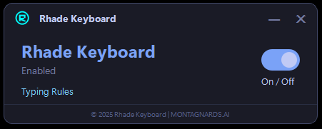

# rhade-keyboard-windows
Windows keyboard software for typing Rhade (Ê Đê) language characters

# Rhade Keyboard for Windows

**Author:** Y Phič Hđơ̆k  
**Website:** montagnards.ai  
**Contact:** contact@montagnards.ai

Windows keyboard software for typing Rhade (Ê Đê) language characters.

## Download & Install

1. **Download:** [RhadeKeyboard.exe](./RhadeKeyboard.exe)
2. **Run:** Double-click the .exe file
3. **Follow:** Installation prompts
4. **Restart:** Your computer (if required)

## Features
- Type Rhade characters: ƀ, č, ñ, ă, ĕ, ĭ, ŏ, ô̆, ŭ, ư̆, ơ̆, ê̆
- Works with all Windows applications
- Easy to install and use

## System Requirements
- Windows 10 or later
- Administrator privileges for installation

## Screenshots

## Support
- Issues: [GitHub Issues](#)
- Email: contact@montagnards.ai

## Related
- [Rhade IPA Chart](https://github.com/jacksaporo/rhade-ipa-chart)
